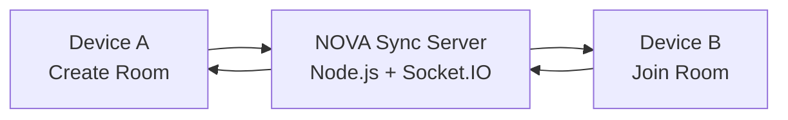

<div align="center">


<br/>


<br/>

<a href="https://nova-music-k6av.onrender.com/">

</a>

</div>

---

<div align="center">

### ✦ A MUSIC PLAYER THAT FEELS ALIVE


</div>

NOVA is a responsive music experience focused on **motion, mood, and shared listening**.  
It combines a polished player with real-time room synchronization, so playback can move across two devices as one shared session.

---

## ⚡ CORE SIGNAL

<table>
<tr>
<td width="33%" align="center">
<h3>🎵 DISCOVER</h3>
Albums, songs, search<br/>and quick playback
</td>
<td width="33%" align="center">
<h3>🎛 CONTROL</h3>
Shuffle, repeat, seek,<br/>queue and likes
</td>
<td width="33%" align="center">
<h3>🎧 SYNC</h3>
Create rooms and control<br/>playback together
</td>
</tr>
</table>

---

## 🌐 LISTEN TOGETHER



<div align="center">

`PLAY` • `PAUSE` • `SEEK` • `NEXT` • `PREVIOUS` • `SHUFFLE` • `REPEAT`


</div>

---

## 🧬 BUILT WITH

<div align="center">


<br/><br/>


</div>

---

## 🎚 NOVA MODES

| Mode | Signal |
|---|---|
| 🔀 **Shuffle** | random track flow |
| 🔁 **Repeat All** | loops the active album |
| 🔂 **Repeat One** | locks onto the current track |
| ❤️ **Liked Songs** | remembers favourites locally |
| ☷ **Queue** | keeps upcoming songs visible |
| 🎧 **Listen Together** | mirrors playback across devices |

---

## 👥 BUILT BY TWO MINDS

<div align="center">

<table>
<tr>
<td align="center" width="50%">


### Ashmita Choudhury

**UI/UX • Frontend • Interaction**

<a href="https://www.linkedin.com/in/ashmita-choudhury-7a630b2ba/">

</a>
<a href="https://github.com/AshmitaNotFound">

</a>
</td>

<td align="center" width="50%">


### Aritra Biswas

**Design • Development • Experience**

<sub>Social links can be added later.</sub>
</td>
</tr>
</table>

</div>

---

## 🚀 RUN

```bash
git clone https://github.com/AshmitaNotFound/nova-music.git
cd nova-music
npm install
node server.js
```

Open:

```text
http://localhost:3000
```

---

<div align="center">


</div>
